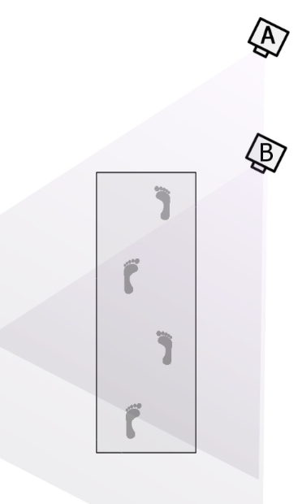
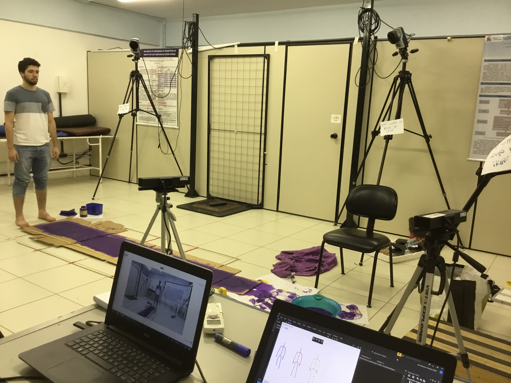
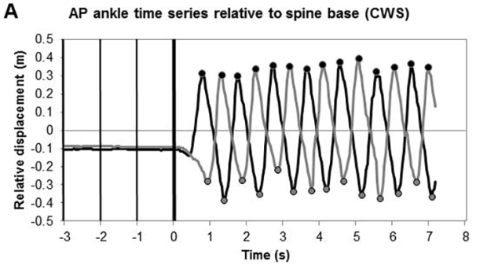
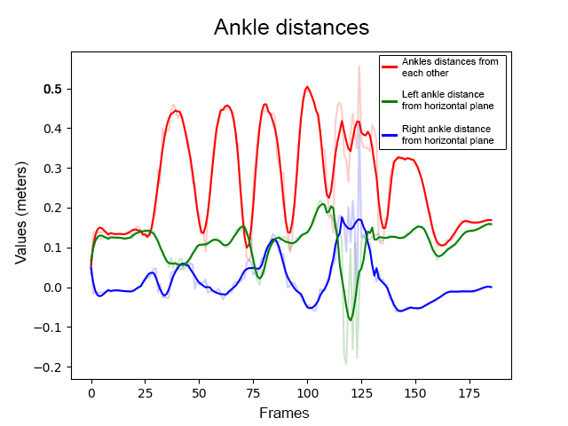

# PetAnalysis

O objetivo deste ciclo é continuar o desenvolvimento de uma aplição que automatiza o processo de análise de marcha com o uso de **dois Kinects** simultaneamente.

## Motivação

Esta aplicação é visada para ser aplicada em clínicas de fisioterapia, dado que no Brasil, tipicamente, clínicas convencionais não têm muito espaço físico e carecem de recursos financeiros para adquirir ferramentas de ponta para fazer a análise de marcha automatizada. Por isso, são forçados a realizarem o processo de forma análogica, o que é um trabalho laboroso que pode ser melhorado em termos de precisão e quantidade de *features* obtidas.

Uma gravação utiliza um espaço no qual o paciente.

1. inicia a marcha,
2. prossegue com a marcha,
3. desacelera para o final da marcha.

Os passos 1 e 3 são descartados para uma análise menos tendenciosa, dado que nessas fases o paciente está acelerando ou desacelerado, o que não configura como uma marcha natural. Por isso, métodos de gravação com câmeras costumam apontá-las para a área que é mais ou menos o centro do local de passada. Para facilitar, a gravação, pretendemos usar dois Kinects para **aumentar o _range_ de gravação últil**.

## Trabalho já realizado

### Setup

Para conseguir fazer uma gravação com mais de uma câmera, é essencial a **sincronização** delas. Como não se pode usar dois Kinects num mesmo computador, o método usa **dois computadores**, cada um resposável por obter as informações de um Kinect conectado. Na indústria de captura de vídeo com múltiplas câmeras, normalmente uma câmera **mestre** grava seu video ao mesmo tempo que recebe a os vídeos das outras câmeras, chamadas de **escravas**.

Com dois vídeos sincronizados, o temos dois **skeletons** sincronizados, mas diferentes. Para avaliar os dados, é necessário unir (**interpolar**) estes dois skeletons em um só. Espera-se que este skeleton produto da soma seja mais preciso e consiga se manter consistente ao longo de todo o percurso útil da marcha.

### Resultados

Como referência para o trabalho, tivemos o artigo [*Kinematic Validation of a Multi-Kinect v2 Instrumented 10-Meter Walkway for Quantitative Gait Assessments*](https://journals.plos.org/plosone/article?id=10.1371/journal.pone.0139913) que conseguiu  captar com consistência uma marcha ao longo de 10 metros usando vários Kinects. Abaixo, um gráfico que representa bem seus resultados:

Este gráfico plota a distância dos calcanhares ao centro do corpo ao longo do tempo. É bem perceptível o **padrão trançado**, pois quando um tornozelo está na frente, o outro está para trás. Um gráfico análogo ao aprestando, mas com nossos resultados é este:

No gráfico, as linhas azul e verde são análogas às linhas preta e cinza do gráfico anterior. Com é possível ver, o gráfico não se parece visualmente em nada com o anterior.

## Objetivo

A priori, **o trabalho de vocês é tentar fazer plotar um gráfico que fique o mais parecido possível com o do artigo referência**. Entende-se que se este gráfico fique consistente, teremos tudo para fazer uma análise de marcha acurada.

Para isso, vocês terão que investigar a causa dos resultados ruins nos testes realizados e tentar consertar para fazer melhor. De antemão, levantei algumas suspeitas.

* iluminação a sala
* distância dos Kinects
* **interpolação dos esqueletos**

Com uma análise bem feita, existem **N aplicações possíveis** e, dependendo do tempo, vocês podem começar a fazer aplicações com o método que vocês criaram também.

Sejam criativos, duvidem do que já foi construído, façam algo que vocês sintam prazer em trabalhar, que **tudo vai dar certo**.